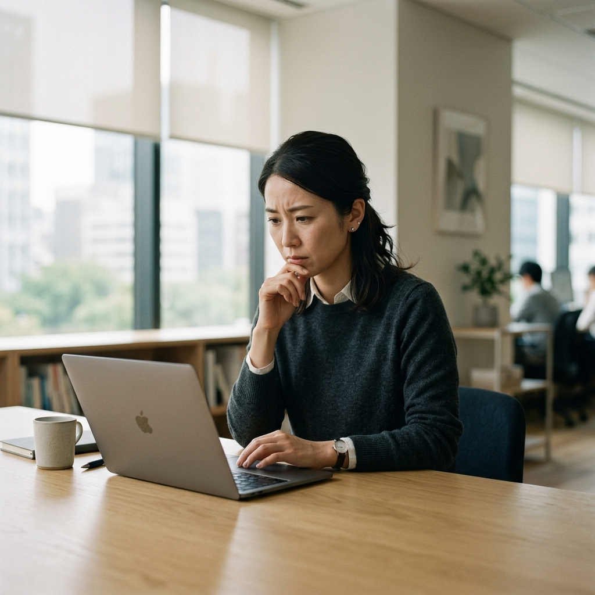
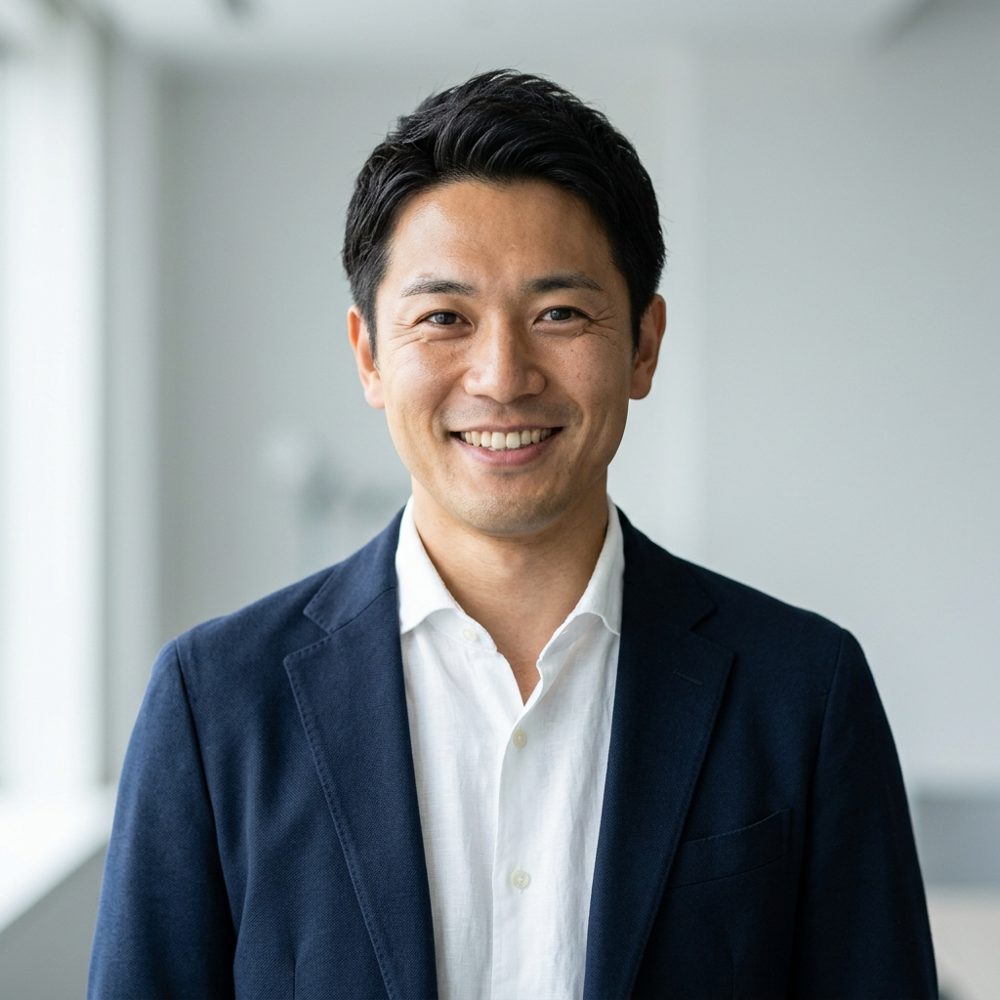

# Nissy AI&WEB LP 画像生成プロンプト集
> まいへの依頼用｜作成：あおい

---

## 【前提：サイト共通テイスト】

以下のデザインコンセプトを全ての画像・アイコンで必ず統一してください。

- **カラーパレット**：ダークネイビー（#1A1A2E）×ホワイト（#FFFFFF）×アクセントブルー（#4A90D9）
- **雰囲気**：信頼感・誠実さ・プロフェッショナル感。余白広め・ミニマル。ごちゃごちゃしていない。
- **NG要素**：派手なビビッドカラー、ポップ・カジュアル・漫画的な表現、過剰な装飾
- **ターゲット像**：30〜40代の会社員（男女問わず）。副業・AI・WEBデザインに興味がある人。

---

## 【画像の実装方法】

生成した画像を `<div class="placeholder ...">` タグに置き換えて、以下のように実装します：

```html
<!-- 変更前（プレースホルダー） -->
<div class="placeholder placeholder--medium"></div>

<!-- 変更後（画像に差し替え） -->

```

または背景画像として使う場合：

```html
<div class="hero__image" style="background-image: url('images/hero.jpg'); background-size: cover; background-position: center;"></div>
```

---

## 【画像リスト】

---

### 画像①：ヒーロー背景画像（最重要）

| 項目 | 内容 |
|------|------|
| 配置箇所 | ② ファーストビュー（Hero）セクション |
| HTMLクラス | `hero__image` |
| サイズ | **全幅 × 600px**（16:9〜21:9比率推奨） |
| ファイル名 | `images/hero.jpg` |

**生成プロンプト（英語）**：

```
A professional and cinematic wide-angle photograph of a modern Japanese man in his late 30s, wearing a neat casual business shirt, working on a laptop in a clean, minimal home office or modern cafe. The atmosphere is calm, focused, and aspirational. Dark navy and white color tones dominate the scene. Soft natural lighting from the left. Shallow depth of field. High resolution, photorealistic, 16:9 aspect ratio. No text. No clutter. Minimalist composition.
```

**補足**：
- 画面左〜中央にメインビジュアルを配置（右側にコピーテキストが重なるため）
- 暗めの落ち着いたトーンが望ましい（オーバーレイで文字が読みやすくなるため）
- 人物が映っても映らなくても可。映る場合は後ろ姿・横顔・手元のどれか

---

### 画像②：Problem セクション（右カラム）

| 項目 | 内容 |
|------|------|
| 配置箇所 | ③ Problem「こんなお悩みありませんか？」 |
| HTMLクラス | `placeholder--medium` (1つ目) |
| サイズ | **400px × 300px** |
| ファイル名 | `images/problem.jpg` |

**生成プロンプト（英語）**：

```
A thoughtful Japanese salaried worker in their late 30s, sitting at a desk with a slightly worried or uncertain expression, looking down at a laptop or smartphone screen. Business casual attire. Clean, minimal office background. Soft warm lighting. Muted, desaturated color palette. Photorealistic. 4:3 aspect ratio. No text.
```

**補足**：
- 「悩んでいる・迷っている」感情を自然に表現した写真
- 表情は暗すぎず、あくまで「共感できる悩み」のトーン

---

### 画像③：Agitation セクション（左カラム）

| 項目 | 内容 |
|------|------|
| 配置箇所 | ④ Agitation「このまま何もしないと5年後どうなる？」 |
| HTMLクラス | `placeholder--medium` (2つ目) |
| サイズ | **400px × 300px** |
| ファイル名 | `images/agitation.jpg` |
| 背景色 | ダークネイビー（#1A1A2E）セクション内に配置 |

**生成プロンプト（英語）**：

```
A dramatic and moody photograph of a Japanese person in their 30s–40s standing at a crossroads or staring out a window at a city night view, looking contemplative and slightly anxious about the future. Dark, cinematic lighting with blue and navy tones. Silhouette or low-key portrait style. Photorealistic. 4:3 aspect ratio. Minimal and atmospheric. No text.
```

**補足**：
- セクション背景がダークネイビーなので、画像もダーク系・ナイト系が馴染みやすい
- 「将来への不安・このままでいいのか」という感情を視覚化

---

### 画像④：Contents セクション（右カラム）

| 項目 | 内容 |
|------|------|
| 配置箇所 | ⑦ Contents「無料相談会でわかること」 |
| HTMLクラス | `placeholder--medium` (3つ目) |
| サイズ | **400px × 300px** |
| ファイル名 | `images/contents.jpg` |

**生成プロンプト（英語）**：

```
A warm and professional photograph of a Japanese man in his 30s–40s smiling and having an online video consultation on a laptop, sitting in a tidy home office. The atmosphere is approachable, trustworthy, and calm. Light background, soft natural lighting, navy and white color tones. Photorealistic. 4:3 aspect ratio. No text.
```

**補足**：
- 「相談会」のシーンを表現。オンライン相談・コーチング・対話のイメージ
- 堅苦しくなく、話しかけやすい温かみのある雰囲気

---

### アイコン①：Solution カード「1日1時間からOK」

| 項目 | 内容 |
|------|------|
| 配置箇所 | ⑤ Solution セクション カード1 |
| サイズ | **80px × 80px** |
| ファイル名 | `images/icon-time.svg` または `icon-time.png` |

**生成プロンプト（英語）**：

```
A clean, minimal flat icon of a clock or hourglass, representing "1 hour per day". Line art style. Color: accent blue (#4A90D9) on white background. Simple and modern. 80x80px. SVG or PNG with transparent background.
```

**補足**：
- 時計・砂時計・スケジュール帳などのモチーフが適切
- フラットデザイン・シンプル・塗りつぶしではなくラインアート推奨

---

### アイコン②：Solution カード「AIがあればスキル不要」

| 項目 | 内容 |
|------|------|
| 配置箇所 | ⑤ Solution セクション カード2 |
| サイズ | **80px × 80px** |
| ファイル名 | `images/icon-ai.svg` または `icon-ai.png` |

**生成プロンプト（英語）**：

```
A clean, minimal flat icon representing AI or artificial intelligence, such as a brain with circuit lines, a robot head, or a sparkle/lightning bolt symbolizing smart assistance. Line art style. Color: accent blue (#4A90D9) on white background. Simple and modern. 80x80px. SVG or PNG with transparent background.
```

**補足**：
- AIらしさを表現しつつシンプルに。回路・スパーク・脳・ロボットなどモチーフ
- 「難しくない・助けてくれる」印象を持たせるデザインが望ましい

---

### アイコン③：Solution カード「会社員のまま実績が作れる」

| 項目 | 内容 |
|------|------|
| 配置箇所 | ⑤ Solution セクション カード3 |
| サイズ | **80px × 80px** |
| ファイル名 | `images/icon-career.svg` または `icon-career.png` |

**生成プロンプト（英語）**：

```
A clean, minimal flat icon representing career growth or building a track record while keeping a stable job, such as an upward-trending bar chart, a briefcase with a star, or a person climbing steps. Line art style. Color: accent blue (#4A90D9) on white background. Simple and modern. 80x80px. SVG or PNG with transparent background.
```

**補足**：
- 「安定しながら成長する」「実績を積む」イメージ
- 棒グラフ・ステップ・バッジ・ブリーフケースなどのモチーフが適切

---

### 人物アバター①：Evidence「Aさん（35歳・製造業・営業職）」

| 項目 | 内容 |
|------|------|
| 配置箇所 | ⑥ Evidence セクション 証言1 |
| サイズ | **80px × 80px（丸型でトリミング）** |
| ファイル名 | `images/avatar-a.jpg` |

**生成プロンプト（英語）**：

```
A professional headshot portrait of a Japanese man in his mid-30s, smiling warmly and confidently. Business casual attire (open collar shirt or light jacket). Clean, simple light background. Natural lighting. Photorealistic. Square composition, centered face, suitable for a circular crop at 80x80px. No text.
```

**補足**：
- 製造業・営業職の35歳男性をイメージ
- 「副業で成果を出せた！」という達成感・自信を感じさせる表情

---

### 人物アバター②：Evidence「Bさん（42歳・IT系・管理職）」

| 項目 | 内容 |
|------|------|
| 配置箇所 | ⑥ Evidence セクション 証言2 |
| サイズ | **80px × 80px（丸型でトリミング）** |
| ファイル名 | `images/avatar-b.jpg` |

**生成プロンプト（英語）**：

```
A professional headshot portrait of a Japanese man in his early 40s, with a composed and reliable expression. Smart business casual attire. Clean, neutral background. Soft natural or studio lighting. Photorealistic. Square composition, centered face, suitable for a circular crop at 80x80px. No text.
```

**補足**：
- IT系管理職の42歳男性をイメージ
- 落ち着きのある、信頼感のある表情・雰囲気

---

### 人物アバター③：Evidence「Cさん（38歳・小売業・店長）」

| 項目 | 内容 |
|------|------|
| 配置箇所 | ⑥ Evidence セクション 証言3 |
| サイズ | **80px × 80px（丸型でトリミング）** |
| ファイル名 | `images/avatar-c.jpg` |

**生成プロンプト（英語）**：

```
A professional headshot portrait of a Japanese woman in her late 30s, smiling warmly with an energetic and friendly expression. Business casual attire. Clean, simple light background. Natural lighting. Photorealistic. Square composition, centered face, suitable for a circular crop at 80x80px. No text.
```

**補足**：
- 小売業・店長の38歳女性をイメージ（Cさんは女性設定が自然なバランス）
- 活発・明るい・親しみやすい雰囲気

---

## 【画像の保存場所と命名規則】

生成した画像は以下のフォルダに保存してください：

```
nissy-ai-web-lp/
├── index.html
├── style/
│   ├── reset.css
│   └── style.css
└── images/              ← ここに全て保存
    ├── hero.jpg
    ├── problem.jpg
    ├── agitation.jpg
    ├── contents.jpg
    ├── icon-time.svg
    ├── icon-ai.svg
    ├── icon-career.svg
    ├── avatar-a.jpg
    ├── avatar-b.jpg
    └── avatar-c.jpg
```

---

## 【HTMLへの実装指示】

画像ファイルが揃ったら、index.html内の `<div class="placeholder ..."></div>` を以下のように差し替えてください。

### ヒーロー背景（hero__image）
```html
<!-- 変更前 -->
<div class="hero__image">

<!-- 変更後：style属性に背景画像を追加 -->
<div class="hero__image" style="background-image: url('images/hero.jpg'); background-size: cover; background-position: center top;">
```

### 通常の画像（placeholder--medium）
```html
<!-- 変更前 -->
<div class="placeholder placeholder--medium"></div>

<!-- 変更後 -->

```

### アイコン（placeholder--icon）
```html
<!-- 変更前 -->
<div class="placeholder placeholder--icon"></div>

<!-- 変更後 -->

```

### アバター（placeholder--avatar）
```html
<!-- 変更前 -->
<div class="placeholder placeholder--avatar"></div>

<!-- 変更後 -->

```

---

## 【補足：各画像の優先度】

| 優先度 | 画像 | 理由 |
|--------|------|------|
| ★★★ 最優先 | ① ヒーロー背景 | 最初に目に入るLP全体の印象を決める |
| ★★★ 最優先 | ④ Contents | 「相談会」への信頼感を直接左右する |
| ★★☆ 高め | ② Problem | ターゲットへの共感ファーストタッチ |
| ★★☆ 高め | アバター①②③ | 社会的証明の説得力に影響 |
| ★☆☆ 通常 | ③ Agitation | ダーク系なので比較的どんな画像でも馴染む |
| ★☆☆ 通常 | アイコン①②③ | テキストで意味は伝わるが、あるとビジュアルが整う |
