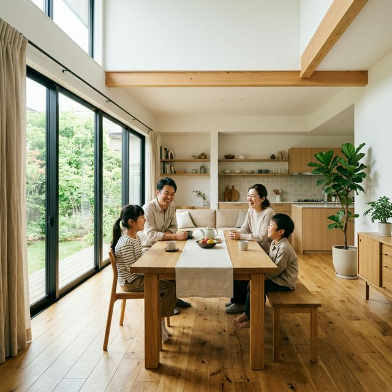
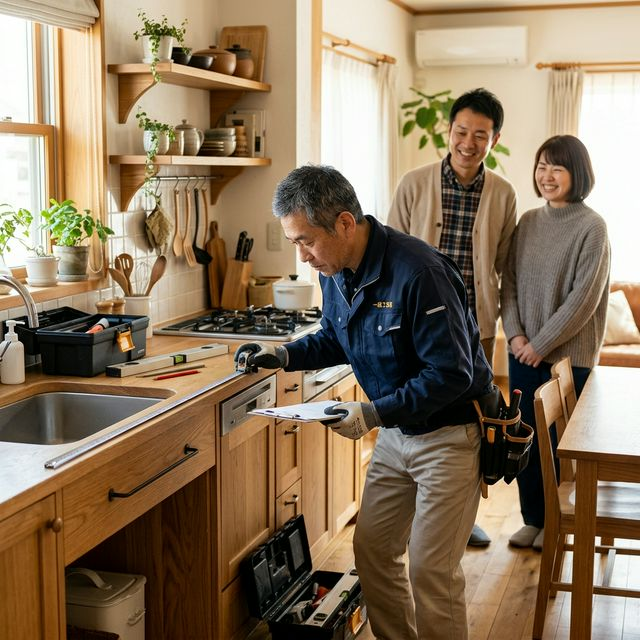
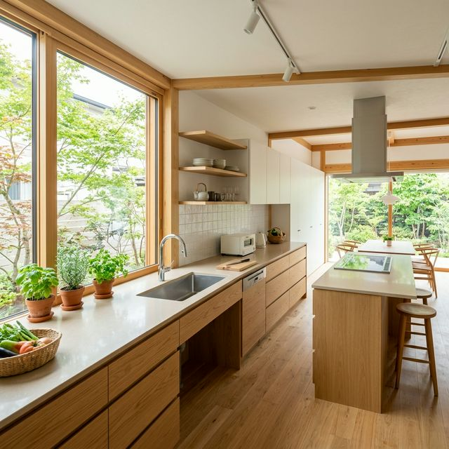
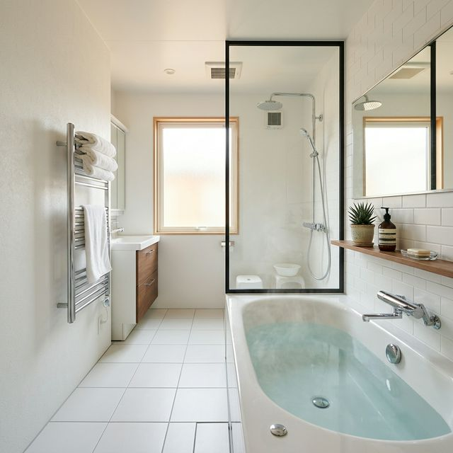
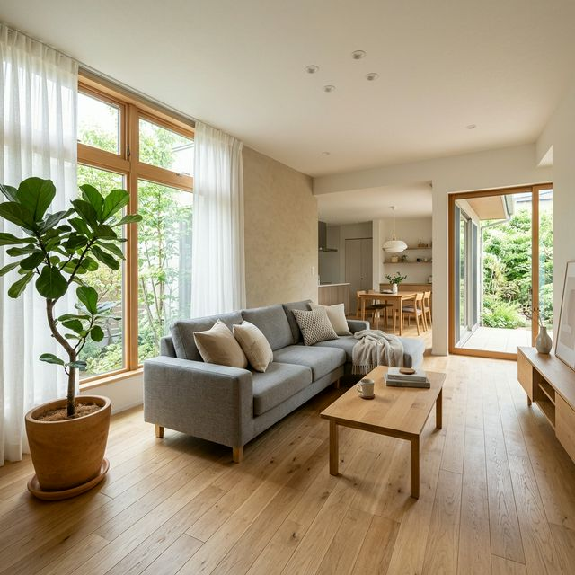
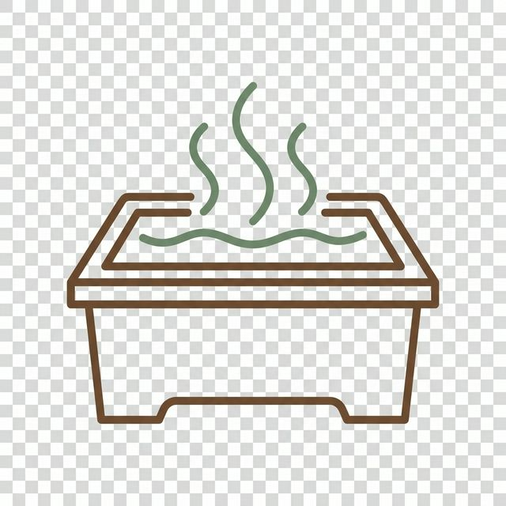
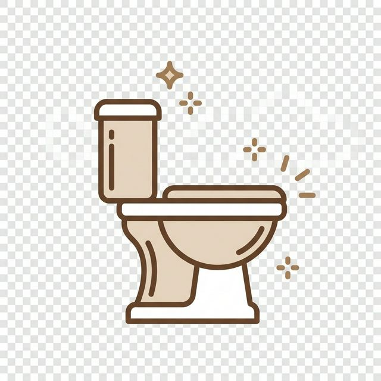
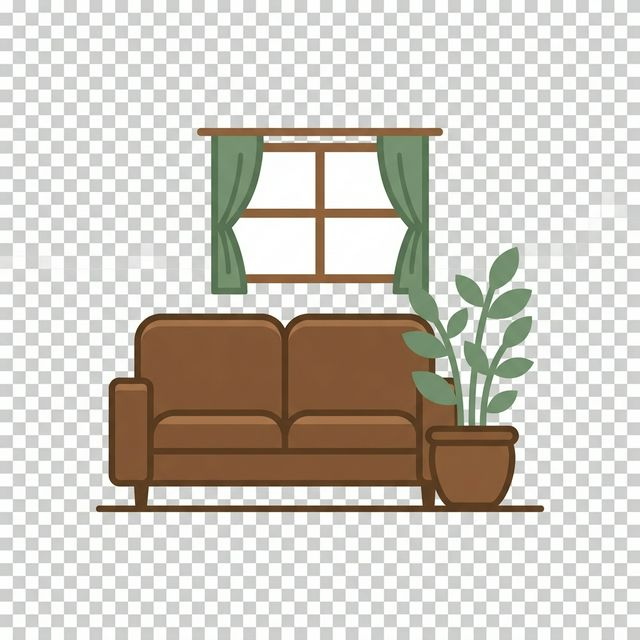
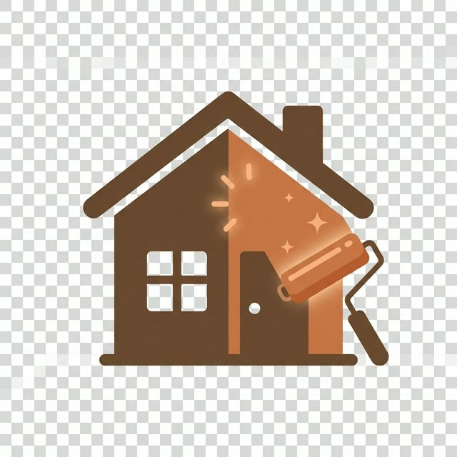
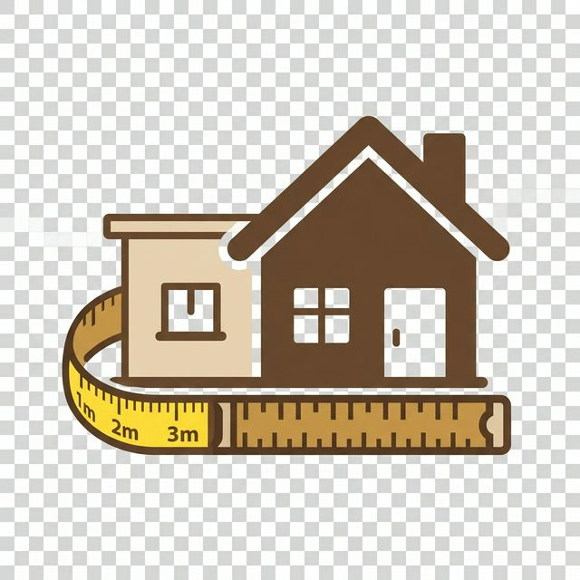

# index.html 画像差し込み プロンプト（コピペ用）

---

以下のタスクを順番に実行してください。

## タスク概要
`index.html` 内にある `#CCCCCC` のグレープレースホルダーを、**Nano Banana2** を使って生成した画像に差し替えてください。生成した画像は `images/` フォルダに保存し、`index.html` の該当箇所を `` タグに書き換えてください。

---

## 前提条件
- 使用する画像生成モデル：**Nano Banana2**
- 登場する人物は**すべて日本人**にすること
- 画像の雰囲気：**温かみのある・ナチュラル・アースカラー（ブラウン・ベージュ・グリーン系）**
- 保存先フォルダ：`images/`（なければ作成する）

---

## ■ 画像①：ヒーロービジュアル

**保存ファイル名：** `images/hero-main.jpg`
**サイズ：** 1920 × 600px

**生成プロンプト：**
```
日本人の40代夫婦と子ども2人が、リフォームされた明るいリビングダイニングで木製のテーブルを囲んで笑顔で談笑している写真。大きな窓から自然光が差し込み、白い壁と無垢材フローリングで清潔感がある。観葉植物、ナチュラルなカーテン。温かみのあるアースカラー。プロの建築写真。横長ワイド構図。
```

**HTML差し替え：**
```html
<!-- 変更前 -->
<div class="img-placeholder img-placeholder--hero">メインビジュアル 1920×600</div>

<!-- 変更後 -->

```

---

## ■ 画像②：コンセプト画像

**保存ファイル名：** `images/concept-image.jpg`
**サイズ：** 600 × 320px

**生成プロンプト：**
```
50代の日本人男性職人（作業着姿）がキッチンのカウンターを丁寧に採寸・点検しており、背後で40代の日本人夫婦が安心した笑顔で見守っている写真。明るく清潔な日本の一般家庭のキッチン。木の温もりのある空間。信頼感と誠実さが伝わるプロの写真。
```

**HTML差し替え：**
```html
<!-- 変更前 -->
<div class="img-placeholder img-placeholder--wide">コンセプト画像 600×320</div>

<!-- 変更後 -->

```

---

## ■ 画像③：施工写真（キッチン）

**保存ファイル名：** `images/works-kitchen.jpg`
**サイズ：** 480 × 240px

**生成プロンプト：**
```
リフォーム後の明るく開放的な日本のキッチン。大きな窓から自然光が降り注ぎ、白とライトウッドのキャビネット、ベージュのカウンタートップ、ステンレスのシンク。窓辺に小さなハーブの鉢植え。人物なし。清潔感あるミニマルな日本のインテリア。プロの建築写真。横長構図。
```

**HTML差し替え：**
```html
<!-- 変更前（キッチンカードの箇所） -->
<div class="img-placeholder img-placeholder--card">施工写真 480×240</div>
<!-- ※ work-card__tagが「キッチン」の箇所 -->

<!-- 変更後 -->

```

---

## ■ 画像④：施工写真（浴室）

**保存ファイル名：** `images/works-bathroom.jpg`
**サイズ：** 480 × 240px

**生成プロンプト：**
```
リフォーム後の清潔でモダンな日本のユニットバス。真っ白な壁と床タイル、深型の白いバスタブ、クロムのシャワー水栓、ガラスのシャワーパーティション。タオルがきれいに掛けられ、小さな緑の植物が棚に。湯気がほのかに漂う温かみのある雰囲気。人物なし。プロの建築写真。横長構図。
```

**HTML差し替え：**
```html
<!-- 変更前（浴室カードの箇所） -->
<div class="img-placeholder img-placeholder--card">施工写真 480×240</div>
<!-- ※ work-card__tagが「浴室」の箇所 -->

<!-- 変更後 -->

```

---

## ■ 画像⑤：施工写真（リビング）

**保存ファイル名：** `images/works-living.jpg`
**サイズ：** 480 × 240px

**生成プロンプト：**
```
リフォーム後の広々とした日本のリビング。ライトオーク無垢材フローリング、白とベージュの壁、グレーのファブリックソファ、低めの木製センターテーブル、大きな窓に薄手の白いカーテン。テラコッタ鉢の観葉植物。人物なし。明るく開放的で家族の団らんが想像できる空間。プロの建築写真。横長構図。
```

**HTML差し替え：**
```html
<!-- 変更前（リビングカードの箇所） -->
<div class="img-placeholder img-placeholder--card">施工写真 480×240</div>
<!-- ※ work-card__tagが「リビング」の箇所 -->

<!-- 変更後 -->

```

---

## ■ 画像⑥：お客様アバター（T.K様）

**保存ファイル名：** `images/avatar-tk.jpg`
**サイズ：** 300 × 300px（表示は56×56px 円形）

**生成プロンプト：**
```
60代前半の日本人女性のポートレート。短めのグレー混じりの黒髪、穏やかで優しい笑顔、薄い色のカジュアルなブラウス。柔らかな自然光。背景はぼかしたベージュ。正直で温かい表情。1:1の正方形構図、顔が中央。プロのポートレート写真。
```

**HTML差し替え：**
```html
<!-- 変更前（T.K様の箇所） -->
<div class="img-placeholder" style="width:56px;height:56px;border-radius:50%;font-size:0.6rem;min-width:56px;">顔写真</div>

<!-- 変更後 -->

```

---

## ■ 画像⑦：お客様アバター（M.S様）

**保存ファイル名：** `images/avatar-ms.jpg`
**サイズ：** 300 × 300px（表示は56×56px 円形）

**生成プロンプト：**
```
40代半ばの日本人女性のポートレート。ミディアムの黒髪、明るく親しみやすい笑顔、柔らかい色のカジュアルな服装。柔らかな室内の自然光。背景はぼかしたライトベージュ。子育て世代の温かみある表情。1:1の正方形構図、顔が中央。プロのポートレート写真。
```

**HTML差し替え：**
```html
<!-- 変更前（M.S様の箇所） -->
<div class="img-placeholder" style="width:56px;height:56px;border-radius:50%;font-size:0.6rem;min-width:56px;">顔写真</div>

<!-- 変更後 -->

```

---

## ■ アイコン①：キッチンリフォーム

**保存ファイル名：** `images/icon-kitchen.png`（PNG透過）
**サイズ：** 256 × 256px

**生成プロンプト：**
```
キッチンのコンロとフライパンをモチーフにしたフラットアイコンイラスト。シンプルな線画スタイル。温かみのあるブラウン（#6B4F3A）とテラコッタ（#C4794A）の配色。透過PNG。テキストなし。256×256px。ウェブサイト用サービスアイコン。
```

**HTML差し替え：**
```html
<!-- 変更前 -->
<div class="service-icon">🍳</div>

<!-- 変更後 -->
<div class="service-icon"></div>
```

---

## ■ アイコン②：浴室リフォーム

**保存ファイル名：** `images/icon-bathroom.png`（PNG透過）
**サイズ：** 256 × 256px

**生成プロンプト：**
```
日本の深型バスタブと湯気をモチーフにしたフラットアイコンイラスト。シンプルな線画スタイル。ブラウン（#6B4F3A）とセージグリーン（#5C7A5C）の配色。透過PNG。テキストなし。256×256px。ウェブサイト用サービスアイコン。
```

**HTML差し替え：**
```html
<!-- 変更前 -->
<div class="service-icon">🛁</div>

<!-- 変更後 -->
<div class="service-icon"></div>
```

---

## ■ アイコン③：トイレリフォーム

**保存ファイル名：** `images/icon-toilet.png`（PNG透過）
**サイズ：** 256 × 256px

**生成プロンプト：**
```
清潔感のある洋式トイレをモチーフにしたフラットアイコンイラスト。輝きの効果を添えて清潔感を表現。シンプルな線画スタイル。ブラウン（#6B4F3A）とベージュの配色。透過PNG。テキストなし。256×256px。ウェブサイト用サービスアイコン。
```

**HTML差し替え：**
```html
<!-- 変更前 -->
<div class="service-icon">🚽</div>

<!-- 変更後 -->
<div class="service-icon"></div>
```

---

## ■ アイコン④：リビング・内装

**保存ファイル名：** `images/icon-living.png`（PNG透過）
**サイズ：** 256 × 256px

**生成プロンプト：**
```
ソファと観葉植物と窓をモチーフにしたフラットアイコンイラスト。リビングルームを象徴するシンプルな構図。温かみのあるブラウン（#6B4F3A）とセージグリーン（#5C7A5C）の配色。透過PNG。テキストなし。256×256px。ウェブサイト用サービスアイコン。
```

**HTML差し替え：**
```html
<!-- 変更前 -->
<div class="service-icon">🛋️</div>

<!-- 変更後 -->
<div class="service-icon"></div>
```

---

## ■ アイコン⑤：外壁・屋根リフォーム

**保存ファイル名：** `images/icon-exterior.png`（PNG透過）
**サイズ：** 256 × 256px

**生成プロンプト：**
```
家のシルエットにペイントローラーが外壁を塗っている様子をモチーフにしたフラットアイコンイラスト。新しくなった外観の輝きを表現。ブラウン（#6B4F3A）とテラコッタ（#C4794A）の配色。透過PNG。テキストなし。256×256px。ウェブサイト用サービスアイコン。
```

**HTML差し替え：**
```html
<!-- 変更前 -->
<div class="service-icon">🏠</div>

<!-- 変更後 -->
<div class="service-icon"></div>
```

---

## ■ アイコン⑥：増築・大規模改修

**保存ファイル名：** `images/icon-extension.png`（PNG透過）
**サイズ：** 256 × 256px

**生成プロンプト：**
```
家のシルエットに増築部分（新しい部屋や棟）が追加されている様子と、メジャー・定規を組み合わせたフラットアイコンイラスト。建築・拡張をイメージ。ブラウン（#6B4F3A）とベージュの配色。透過PNG。テキストなし。256×256px。ウェブサイト用サービスアイコン。
```

**HTML差し替え：**
```html
<!-- 変更前 -->
<div class="service-icon">🔨</div>

<!-- 変更後 -->
<div class="service-icon"></div>
```

---

## 最終確認

すべての画像生成と差し替えが完了したら、以下を確認してください。

1. `images/` フォルダに13枚のファイルがあること
2. `index.html` 内に `img-placeholder` クラスのdivが残っていないこと
3. すべての `` タグに `alt` 属性があること
4. ブラウザで開いて全画像が正常に表示されること
