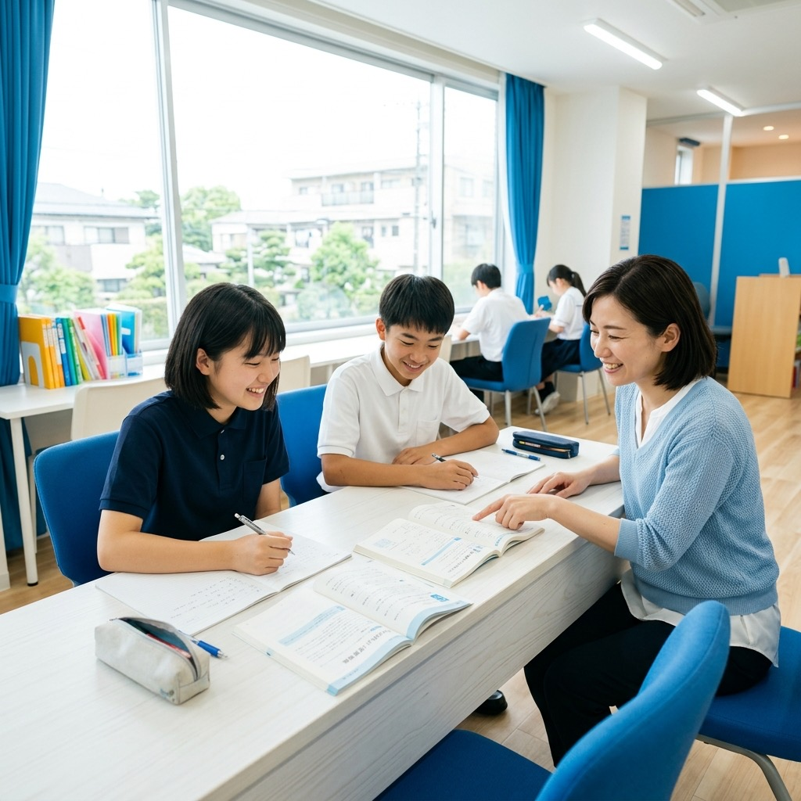

# 赤星学習塾 HP 画像プロンプト集
## Nano Banana2 使用 / 全18枚

---

> **共通の品質設定（すべてのプロンプトに末尾追加）**
> ```
> 高解像度, リアルフォト, プロのカメラマン撮影, 自然な構図, 柔らかい光, 温かみのある雰囲気
> ```
> ※ネガティブプロンプト（全枚共通）
> ```
> アニメ, イラスト, 外国人, 白人, ぼやけ, 低品質, 暗い, 怖い表情, 違和感のある手や指
> ```

---

## 📁 index.html（トップページ）

---

### 【画像01】ヒービジュアル（hero-img-placeholder）
**使用箇所：** ファーストビューの背景画像  
**推奨サイズ：** 1920×800px（横長）  
**ファイル名：** `img/hero-main.jpg`

```
明るく開放的な個別指導塾の教室, 日本人の中学生の男の子と女の子が2人, 横に座って勉強している様子, 
30代の日本人女性講師が丁寧に教えている, 白いデスク, 大きな窓から差し込む自然光, 
ブルー系のアクセントカラー, 笑顔で活気のある雰囲気, 教科書とノートが広がっている, 
清潔感のある現代的な学習空間, 広角撮影, 横長構図, ポジティブで希望に満ちた空気感
```

---

### 【画像02】選ばれる理由カード1（reason-card-img-placeholder ①）
**使用箇所：** 「講師1人に生徒2人まで」カード画像  
**推奨サイズ：** 800×550px（横長）  
**ファイル名：** `img/reason-01.jpg`

```
日本人の40代男性講師と中学生の女の子が1対1で向き合って勉強している, 
ホワイトボードの前, 講師が優しく説明している表情, 生徒が真剣にノートを取っている, 
明るい室内, 信頼感と安心感のある雰囲気, 温かいオレンジ系の照明, 
先生と生徒の自然なやりとりが伝わる構図, 清潔感のある学習環境
```

---

### 【画像03】選ばれる理由カード2（reason-card-img-placeholder ②）
**使用箇所：** 「大阪の公立入試を知り尽くした対策」カード画像  
**推奨サイズ：** 800×550px（横長）  
**ファイル名：** `img/reason-02.jpg`

```
日本人の中学3年生の男の子が集中して問題集を解いている, 机の上に過去問や参考書が広がっている, 
真剣で意欲的な表情, やる気と集中力が伝わる, 夜の塾の教室, 蛍光灯の光, 
ペンを持って書き込んでいる, 合格に向かって頑張る雰囲気, 参考書のページがアップ
```

---

### 【画像04】選ばれる理由カード3（reason-card-img-placeholder ③）
**使用箇所：** 「定期テストから内申点までトータルサポート」カード画像  
**推奨サイズ：** 800×550px（横長）  
**ファイル名：** `img/reason-03.jpg`

```
日本人の中学生の女の子がテスト結果を見て嬉しそうに笑っている, 
「100点」や「A評価」が書かれたプリントを手に持っている, 
保護者の30代日本人女性（母親）が隣で一緒に喜んでいる, 
明るい笑顔, 達成感と安心感, 暖かいリビングのような空間, 自然光
```

---

### 【画像05】合格体験記プレビュー（voice-card-img ①）
**使用箇所：** S.T さん（天王寺高校合格）の顔写真  
**推奨サイズ：** 200×200px（正方形・円形表示）  
**ファイル名：** `img/voice-thumb-01.jpg`

```
日本人の中学3年生の男の子, 制服姿, 合格通知書を持って満面の笑み, 
清潔感のある短髪, 明るい表情, 希望に満ちた瞳, 白背景またはぼかした教室背景, 
上半身ポートレート, 正面から撮影, 自然な笑顔, 親しみやすい雰囲気
```

---

### 【画像06】合格体験記プレビュー（voice-card-img ②）
**使用箇所：** K.M さん（大手前高校合格）の顔写真  
**推奨サイズ：** 200×200px（正方形・円形表示）  
**ファイル名：** `img/voice-thumb-02.jpg`

```
日本人の中学3年生の女の子, 制服姿, 笑顔でピースサイン, 
ポニーテールまたは自然なショートヘア, 活発で明るい印象, 
白背景またはぼかした教室背景, 上半身ポートレート, 正面から撮影, 
友達に自慢したくなるような明るい表情, 青春感
```

---

## 📁 reason.html（選ばれる理由）

---

### 【画像07】理由詳細1（reason-detail-img ①）
**使用箇所：** 「講師1人に生徒2人まで」詳細セクション左  
**推奨サイズ：** 1200×760px（横長）  
**ファイル名：** `img/reason-detail-01.jpg`

```
日本人の40代男性塾講師と中学生2人（男の子・女の子）が個別指導を受けている, 
生徒2人と先生が三角形に座る配置, 先生が問題の解き方を丁寧に指差している, 
ノートとテキストが広がる白いデスク, 明るく清潔な教室, 
生徒たちが集中しながらもリラックスした表情, 安心できる雰囲気, 自然な広角撮影
```

---

### 【画像08】理由詳細2（reason-detail-img ②）
**使用箇所：** 「大阪の公立入試特化」詳細セクション右  
**推奨サイズ：** 1200×760px（横長）  
**ファイル名：** `img/reason-detail-02.jpg`

```
日本人の30代女性講師が黒板またはホワイトボードに入試問題の解法を書いている, 
中学3年生の男の子が真剣な表情で聞いている, 
ホワイトボードに「受験対策」「合格」などの文字がある, 
真剣な学習の雰囲気, 集中した空気, 適度な緊張感と達成への期待感, 
プロフェッショナルな指導シーン
```

---

### 【画像09】理由詳細3（reason-detail-img ③）
**使用箇所：** 「定期テスト対策→内申点UP」詳細セクション左  
**推奨サイズ：** 1200×760px（横長）  
**ファイル名：** `img/reason-detail-03.jpg`

```
日本人の中学生の女の子がテスト前に一生懸命勉強している, 
積み重なった問題集と蛍光ペンでマーカーを引いたノート, 
集中して書き込みをしている手元のクローズアップ, 
やる気と緊張感が伝わる, 夜の塾の雰囲気, 机のスタンドライト, 
頑張る中学生を応援したくなるような温かい構図
```

---

### 【画像10】理由詳細4（reason-detail-img ④）
**使用箇所：** 「塾長による定期面談」詳細セクション右  
**推奨サイズ：** 1200×760px（横長）  
**ファイル名：** `img/reason-detail-04.jpg`

```
40代の日本人男性塾長と30代の日本人女性保護者（母親）が向かい合って面談している, 
テーブルを挟んで座り、資料を見ながら話し合っている, 
塾長が穏やかな表情で説明している, 保護者が安心した表情で頷いている, 
明るい個室または応接スペース, 信頼と安心感があふれるシーン, 
コーヒーカップが置かれた清潔な会議テーブル, プロフェッショナルな雰囲気
```

---

### 【画像11】塾長プロフィール写真（teacher-principal-img）
**使用箇所：** 赤星圭悟 塾長の顔写真  
**推奨サイズ：** 560×720px（縦長ポートレート）  
**ファイル名：** `img/teacher-principal.jpg`

> **キャラクター設定：赤星圭悟（40代男性）**

```
40代の日本人男性, 知性と誠実さが伝わる穏やかな笑顔, 
清潔感のある黒または紺のスーツ, 白いワイシャツ, ネクタイなし（またはシンプルなネクタイ）, 
短髪で清潔感があり少しグレーが混じった黒髪, 
教室または本棚を背景にしたプロのポートレート写真, 
保護者が「この先生に任せたい」と思う信頼感のある表情, 
正面または斜め向き, 上半身〜バストショット, 自然光または柔らかいスタジオ光
```

---

### 【画像12】講師カード写真（teacher-card-img ①）
**使用箇所：** 山田美咲（英語・国語担当）の写真  
**推奨サイズ：** 800×400px（横長）  
**ファイル名：** `img/teacher-yamada.jpg`

> **キャラクター設定：山田美咲（30代女性）**

```
30代の日本人女性, 明るく親しみやすい笑顔, 
シンプルで清潔感のある白または水色のブラウス, 
サラサラのミディアムヘアまたはポニーテール, 
やさしい表情で生徒に語りかけるような目線, 
明るい教室を背景にした自然なポートレート, 
「英語って楽しい！」という雰囲気が伝わる活発な印象, 上半身ショット
```

---

### 【画像13】講師カード写真（teacher-card-img ②）
**使用箇所：** 佐藤翔太（数学・理科担当）の写真  
**推奨サイズ：** 800×400px（横長）  
**ファイル名：** `img/teacher-sato.jpg`

> **キャラクター設定：佐藤翔太（40代男性）**

```
40代の日本人男性, 知的で落ち着いた笑顔, 
スマートカジュアルな服装（コットンシャツ＋スラックス）, 
短髪, 頼もしく知性的な印象, 眼鏡をかけていても良い, 
ホワイトボードまたは数式が書かれた黒板を背景に, 
「数学を楽しく教えてくれそう」な雰囲気, 腕を組んだ自信ある立ち姿, 上半身ショット
```

---

### 【画像14】講師カード写真（teacher-card-img ③）
**使用箇所：** 中村あかり（数学・社会担当）の写真  
**推奨サイズ：** 800×400px（横長）  
**ファイル名：** `img/teacher-nakamura.jpg`

> **キャラクター設定：中村あかり（30代女性）**

```
30代の日本人女性, はきはきとした元気な笑顔, 
オレンジまたはベージュ系のシンプルなトップス, 
ショートヘアまたは内巻きボブ, 
活発でエネルギッシュな印象, 生徒を引っ張っていく頼もしさ, 
明るい教室で腕を組んだポーズまたは黒板の前で立つ姿, 
「一緒に頑張ろう！」という雰囲気, 上半身ショット
```

---

## 📁 course.html（コース）

---

### 【画像15】中1コース詳細画像（course-detail-img ①）
**使用箇所：** 「中1コース 基礎固め＆学習習慣づくり」セクション  
**推奨サイズ：** 1200×760px（横長）  
**ファイル名：** `img/course-chu1.jpg`

```
日本人の中学1年生の女の子または男の子（制服姿）が初めての塾で勉強している, 
少し緊張しているが徐々に笑顔になっている雰囲気, 
30代の日本人女性講師が横に寄り添いながら丁寧に教えている, 
英語か数学の教科書が開かれている, 
「ここから始まる」という希望と期待感, 明るい教室, 春の窓外の景色, 温かい自然光
```

---

### 【画像16】中2コース詳細画像（course-detail-img ②）
**使用箇所：** 「中2コース 内申点対策＆実力養成」セクション  
**推奨サイズ：** 1200×760px（横長）  
**ファイル名：** `img/course-chu2.jpg`

```
日本人の中学2年生の男の子が成績表または通知表を見ている, 
横に座った保護者（30代日本人女性・母親）が一緒に見て嬉しそうにしている, 
成績が上がったことを喜ぶ温かいシーン, 
自宅のリビングまたは塾の面談室, 
親子の安心感と達成感が伝わる構図, 成績表がアップ気味に映り込んでいる
```

---

### 【画像17】中3コース詳細画像（course-detail-img ③）
**使用箇所：** 「中3コース 志望校別入試対策」セクション  
**推奨サイズ：** 1200×760px（横長）  
**ファイル名：** `img/course-chu3.jpg`

```
日本人の中学3年生の男の子が志望校の下調べをしている, 
机の上に高校のパンフレットや過去問, ノートが広がっている, 
真剣な表情の中にも希望と決意がある, 
「絶対に合格してみせる」という強い意志が伝わる, 
塾の夜の教室, デスクライトの光, 一人で集中している様子, 
缶コーヒーまたは飲み物が横にある受験生のリアルなシーン
```

---

## 📁 voice.html（合格体験記）

---

### 【画像18〜23】合格体験記 顔写真6枚（voice-full-card-img ①〜⑥）
**使用箇所：** 6人の合格体験記カード（円形表示80×80px）  
**推奨サイズ：** 400×400px（正方形・円形トリミング想定）  
**ファイル名：** `img/voice-01.jpg` 〜 `img/voice-06.jpg`

> ⚠️ **6枚まとめて生成するよりも、1枚ずつプロンプトを変えて生成推奨**

---

#### 画像18｜S.T さん（天王寺高校合格・男子）
**ファイル名：** `img/voice-01.jpg`
```
日本人の中学3年生の男の子, 学ランまたは制服姿, 
合格発表の喜びで満面の笑み, 握りこぶしでガッツポーズ, 
白または明るいぼかし背景, 正面ポートレート, 信頼感のある目, 
「努力が報われた」という達成感にあふれる表情
```

---

#### 画像19｜K.M さん（大手前高校合格・女子）
**ファイル名：** `img/voice-02.jpg`
```
日本人の中学3年生の女の子, セーラー服または制服, 
ほっとして嬉しそうな自然な笑顔, 髪を結んでいる, 
白または明るいぼかし背景, 正面ポートレート, 
「やり遂げた」という達成感と安堵感が伝わる表情, 親しみやすい
```

---

#### 画像20｜A.Y さん（高津高校合格・女子）
**ファイル名：** `img/voice-03.jpg`
```
日本人の中学3年生の女の子, 制服, 
少しはにかみながらも嬉しそうな笑顔, 
ショートヘアまたは三つ編み, 元気で明るい印象, 
白または明るい背景, 正面ポートレート, やる気が伝わる目
```

---

#### 画像21｜R.N さん（春日丘高校合格・男子）
**ファイル名：** `img/voice-04.jpg`
```
日本人の中学3年生の男の子, 学ランまたは制服, 
自信に満ちた笑顔, 少し大人びた落ち着いた表情, 
白または明るいぼかし背景, 正面ポートレート, 
受験を乗り越えた凛々しさと爽やかさ
```

---

#### 画像22｜M.H さん（四條畷高校合格・男子）
**ファイル名：** `img/voice-05.jpg`
```
日本人の中学3年生の男の子, 制服, 
温かくて穏やかな笑顔, 3年間頑張ってきた安堵感, 
白または明るい背景, 正面ポートレート, 
「続けてよかった」という充実感が伝わる表情, やさしい目
```

---

#### 画像23｜Y.S さん（寝屋川高校合格・女子）
**ファイル名：** `img/voice-06.jpg`
```
日本人の中学3年生の女の子, 制服, 
驚きと喜びが混じった合格したばかりの表情, 
両手で口元を押さえながら喜んでいる, 
白または明るいぼかし背景, 正面ポートレート, 
「まさか合格できるとは！」という感動が伝わるシーン
```

---

## 📁 補足：保護者の安心感イメージ（オプション）

---

### 【画像24】保護者の安心感カット（オプション）
**使用箇所：** 必要に応じてCTAセクションやフッター背景などに使用可  
**推奨サイズ：** 1920×800px  
**ファイル名：** `img/parent-trust.jpg`

```
30代の日本人女性保護者（母親）が我が子の成績表を手にほっとして微笑んでいる, 
横に中学2年生の子ども（男の子または女の子）が照れながら嬉しそうにしている, 
自宅リビングの温かいシーン, 夕方の自然光, 
「この塾に任せてよかった」という安心感と幸福感が伝わる構図, 
ナチュラルで暖かいトーン, 家族のやわらかい空気感
```

---

## 📌 生成後の作業メモ（HTMLへの適用方法）

生成した画像を `img/` フォルダに保存後、各HTMLファイルの該当箇所を以下のように書き換えてください。

### 変更前（プレースホルダー）
```html
<div class="hero-img-placeholder"></div>
```

### 変更後（画像に置き換え）
```html

```

> ※CSSの `.hero-img-placeholder` クラスに `background-image: url(...)` を使う方法でも対応可

---

**各クラスと画像ファイルの対応表**

| クラス名 | ファイル名 | ページ |
|---|---|---|
| `.hero-img-placeholder` | `img/hero-main.jpg` | index |
| `.reason-card-img-placeholder`（①） | `img/reason-01.jpg` | index |
| `.reason-card-img-placeholder`（②） | `img/reason-02.jpg` | index |
| `.reason-card-img-placeholder`（③） | `img/reason-03.jpg` | index |
| `.voice-card-img`（①） | `img/voice-thumb-01.jpg` | index |
| `.voice-card-img`（②） | `img/voice-thumb-02.jpg` | index |
| `.reason-detail-img`（①） | `img/reason-detail-01.jpg` | reason |
| `.reason-detail-img`（②） | `img/reason-detail-02.jpg` | reason |
| `.reason-detail-img`（③） | `img/reason-detail-03.jpg` | reason |
| `.reason-detail-img`（④） | `img/reason-detail-04.jpg` | reason |
| `.teacher-principal-img` | `img/teacher-principal.jpg` | reason |
| `.teacher-card-img`（山田） | `img/teacher-yamada.jpg` | reason |
| `.teacher-card-img`（佐藤） | `img/teacher-sato.jpg` | reason |
| `.teacher-card-img`（中村） | `img/teacher-nakamura.jpg` | reason |
| `.course-detail-img`（中1） | `img/course-chu1.jpg` | course |
| `.course-detail-img`（中2） | `img/course-chu2.jpg` | course |
| `.course-detail-img`（中3） | `img/course-chu3.jpg` | course |
| `.voice-full-card-img`（S.T） | `img/voice-01.jpg` | voice |
| `.voice-full-card-img`（K.M） | `img/voice-02.jpg` | voice |
| `.voice-full-card-img`（A.Y） | `img/voice-03.jpg` | voice |
| `.voice-full-card-img`（R.N） | `img/voice-04.jpg` | voice |
| `.voice-full-card-img`（M.H） | `img/voice-05.jpg` | voice |
| `.voice-full-card-img`（Y.S） | `img/voice-06.jpg` | voice |
